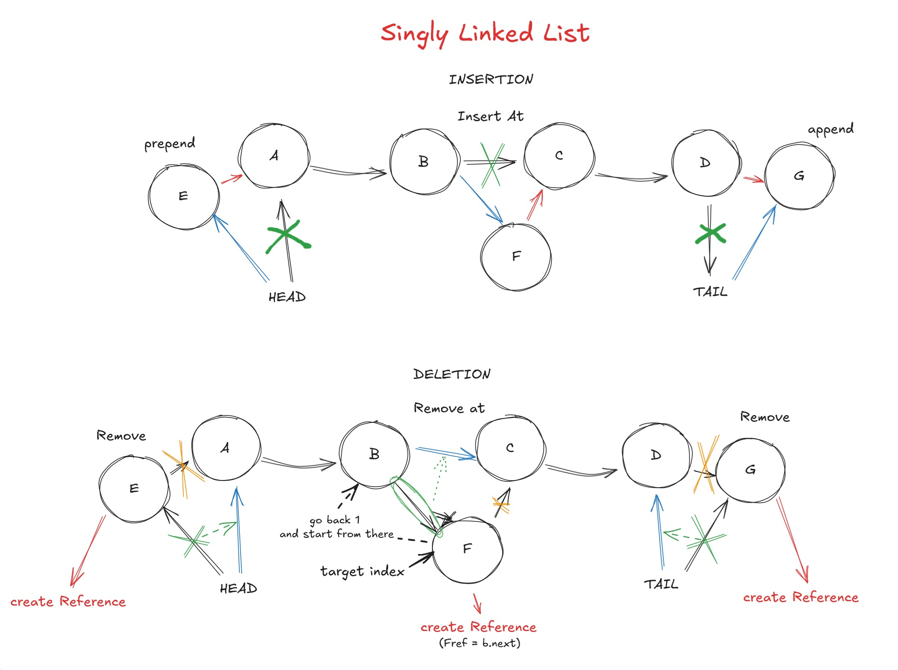
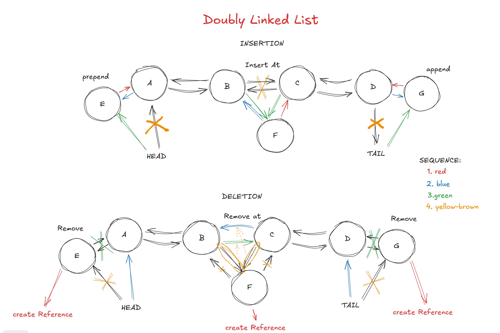

# Big O and Data structures

## BIG O

As your input grows, how fast does computation or memory grow?

Important complexity concept to Remember:

- grows is with respect to input.
- drop the constant
- expect the worst case

Another easier way to understand what the time complexity of an algorithm is to how it handles N
Example:

- Linear (O(N)) is when you go through all N elements once.
  You touch every item from start to finish.
- Logarithmic (O(log N)) is when you keep cutting the problem in half.
  Each step eliminates half of the remaining elements, so you don't need to look at all N.
- Square root (O(√N)) is when you make about √N groups of √N elements each.
  You're not going through all N, but more than just halving it.

## trick to tell what complexity a logic is

- identify what your input is
- then double it.

  - if the amount of operation grows twice = linear
  - if the amount of operations grows quadratically = n2(area) thus area
  - if the amount of operations grows eight folds = n3 (cube) thus volume

- look for loops

```ts
function sum_char_codes(n: string): number {
  let sum = 0;
  for (let i = 0; i < n.length; i++) {
    sum += n.charCodeAt(i);
  }

  return sum;
}
```

in the example above it is a O(n) because the iteration(looping) output of n depends on the count of n parameter.
As "n" grows the output grows(linear = O(n))

## Another Big O trick

if the input halves at each steps, its likely O(logN) or O(NlogN)

- halving means = log
- multiplying means = squared

---

## Data Structures

### Array

Fixed-size arrays are the arrays that can be modified but the length cant be added or reduce meaning, you cant add new value, you can only modify the value, and delete a value , you can null the value but not really delete its index.

Dynamic-size arrays like in JavaScript are the arrays that can be delete,added, and modified. This is because under the hood JavaScript engines adds more memory when creating an array, this is called array over-allocation.
But in the case of adding more values in the array if it hit the allocation capacity, it will now create a new memory for that array copy the current array to the new memory and then add the new values to that new array in memory and the reference of the old array will now be assigned to the new array in memory.
Now the old array in memory will be subject to Garbage collection since it doesn't have any reference anymore and now inaccessible.

### Array List

This is most likely the array data structures that JavaScript uses because in this data structure you can grow the array, you can do the push,pop,shift,unshift operations. Shift and unshift operations are JS syntax for adding and removing the value/data in the first index of an array.

It has an index based head and tail. Index 0 is the head and length - 1 is the tail

Under the hood what its doing is very similar to JavaScript where it will create an array with more capacity. It will keep tracks of the defined value through the length property and you can do the grow operations by just adding a value to the "empty" indexes and when it exceeds the capacity it will now assign to a new array with bigger capacity and copy the value from the old array to the new one and also assign the its reference to the new array.

For its grow operations it has a time complexity as follows:

- push and pop = O(1) a constant complexity because you juse need to get the length(constant) of the array and do the operations:

  - example: (this is just for presentational purpose of the array list)

  ```JavaScript
  // pop
  const array = [1, 2, ,3 ,4 ,5]
  const reference = array[array.length-1]
  array[array.length-1] = undefined

  // push
  array[array.length + 1 ] = 6
  ```

- shift,unshift = O(n) the reason why this is not a constant time and became linear time because of what is happening under the hood. Since Array List have an extra capacity to take in another value those capacity is in the last index of the array meaning if you are going to do add a value in the first index(**unshift**) what you have to do is to shift the 0th index to the right (to the length+1 index) so that the new value you added will have a pointing reference to the index 0 and its subsequent values will be pointing to the correct index as well (length+1)
  By doing that shifting of values indexes we will have to traverse to all of the values of the arrays thus became a linear time complexity. It is also the same with the **shift** (removing) but the other way around normally get the reference of that value and shift the second index to the first index, most likely will be `array[0] = array[1]` and do the same to its subsequent values of the array.

- traverse = O(n) normally when traversing to the value of the array but there are algorithm that can change it

### Ring Buffers (array buffers)

---

### Linked List

Have two categories:

- Singly Linked



- Doubly Linked



It is a Tree/graph like structure where it has its own node. It has a head and tail that points the start of the linked list and end of the linked list. In order to the get the value of a node you have to traverse from head to the n value. The good thing about this structure is the operations for head and tails is constant since you have a reference for the both of them you don't to traverse over the nodes and you don't really care or need the length of the linked list. Traversing in other hand is where it became O(n) linear since you have to go node for node to get the result of the (n) node that you need.

---

### Trees

It is list of nodes with its branches nodes.

Types:

- general tree = a node tree that can have an infinite branching factor, means, it is possible that a node can have multiple leaves or children and the other node don't have a leaf.

- binary tree = by the word itself binary means two. It has a branching factor of 2, means, every node can only have two leaves ( 2 children)
