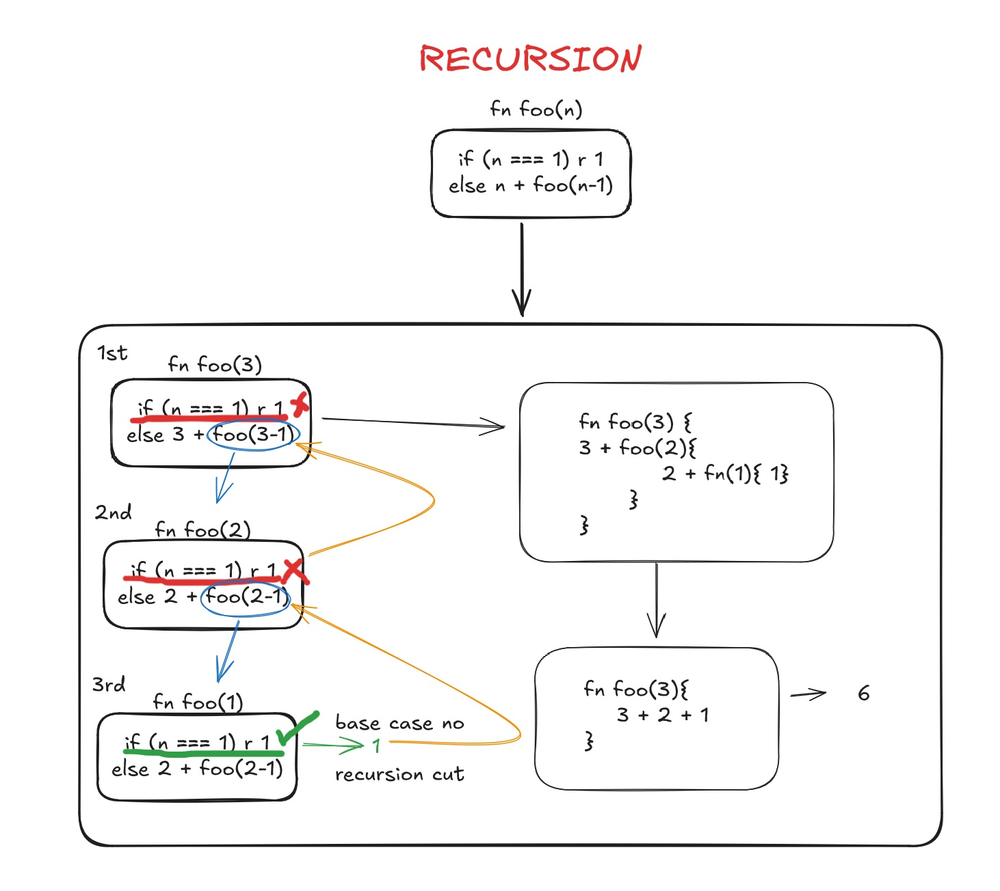
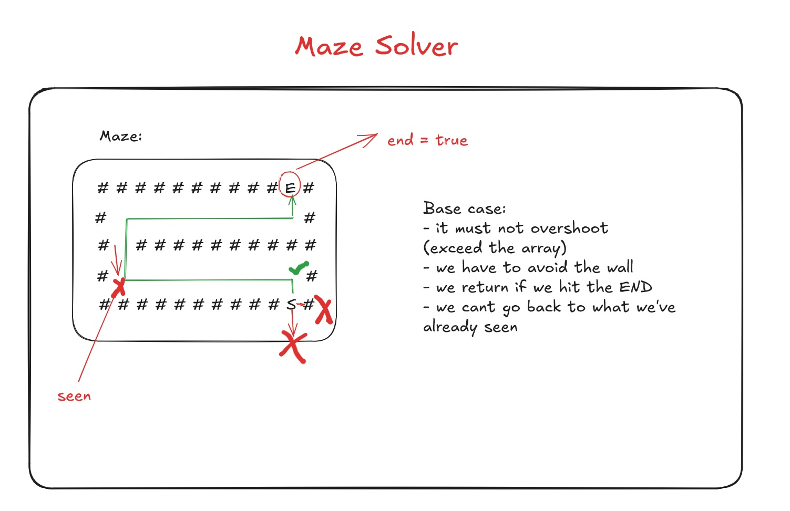

# Algorithms

This is using primeagen's kata-machine(algorithm library)

## SEARCH

Means iteration over the data structure and finding the value from it

---

### Linear search

- means searching over a data structure from o to n (index 0 until the last index)
- this is the array.indexOf implementation under the hood
- it has a time complexity of O(n),linear, because as the input grows the iteration and computation grows

#### how the algorithm works?

1. you need to iterate over the array(data structure)
2. 1 by 1 you'll check if the iterated value is equal to the value you're looking for

---

### Binary Search

It is a halving technique of search. It means you need to get the high and the low and go to the mid point and check the value of that mid point if it is the value you are looking for, if it is you got the value, if it isn't then you need to identify if the **value <ins>of</ins> that mid point** is lower or higher **than your value** then choose accordingly. If the midpoint is lower than the value, you will proceed to do "halving" on the high part of the structure, else , go to the lower side.

**REMEMBER**:

- this approach is on the **assumption** that the array is **SORTED**. It wont work if it isn't.
- this approach is a O(logN) time complexity.
- you must not do a linear search in between of halving because that will make it to Big O(N) (worst case scenario = the value isn't there so have to do another halving and have to linear search, thus will grow linearly)

#### how the algorithm works?

1. you need to assign high and low point in order to know where to do the "halving"
2. assign a midpoint base on the high and low which will be, low+ (high - low) / 2
3. Identify if that mid point is higher or lower than the value that we are looking for.

- if the value is higher than the mid point, meaning from low point(index) until the midpoint is all lower than the value, hence you start "halving" from midpoint to the high point. If it is the case, low is now midpoint + 1(because there is not point to start at mid point since we know the value) and highpoint is the same, and start the search from there.
- if the value if lower than the midpoint, meaning from midpoint to highest point(last index) are all higher meaning we **exceeded**. So the midpoint now is the new high point and start halving from low + (high - low)/2

4. keeps on halving until the condition/value is found else return false(not found it)

### O($\sqrt{N}$) (two crystal search)

this search is about an optimized search, this is to solve a linear search(O(n) search). As usual this is only effective for certain condition which is the array must be **sorted**. This is useful for searching the first truthy value of the series of truthy and falsy.

#### how the algorithm works?

1. you need to get square root of the total index (length) of an array. Like:{Math.floor(Math.sqrt(array.length))}
2. we use floor to ensure we are getting the whole number for index
3. we can now iterate over the array by using the sqrt value as an index and as a iterator
   Example:

```js
const jumpIndex = Math.floor(Math.sqrt(array.length))

let i = jumpIndex
(;i<array.length;i+=jumpIndex){
   if(array[i]){break}
}
```

the reason the variable "i" is outside the for loop, is to access the last value of the square root jump instead of only accessing it by its own for loop scope it has to be taken out of the scope. This is important because this will serve as a stopping and reference point to where the iteration found the _truthy_ value.

4. after finding the last square root value on where the truthy value is. We now **have to go back** one square root jump (i -= jumpValue) to go back to the _last known value_ where when the falsy is and start the iteration from there until we find the truthy value.  
   This way the worst case scenario of our **SEARCH** is only O($\sqrt{N}$) because we only iterate from square root to square root(drop constant , hence sqrtN).
   Example:

```js
i -= jumpValue
(let j = 0; j<jumpValue && i < array.length; j++,i++){
   if(array[i]){
      return i
   }
}

```

the reason we need to specify `j < jumpValue` and `i < array.length` is to start over from where the iteration ended where we backtrack and `j++` and `i++` is the normal iteration where we need to check 1 by 1 if we find the value

---

## SORT

By the word itself sorting over the array by using algorithm

### Bubble sort

A sorting technique that will always sort the end of the array in every iteration. Meaning in every iteration of sorting in Bubble sort the end is always the first one that is being sorted, this is important because with this you can just always exclude the last index of the array and as you do the iteration you also increment the exclusion by +1 on every iteration(like length - i) until you reached the first index means everything is sorted.

It has a time complexity of O(n2) since your iteration is N then N-1 until N-N+1(first index). Meaning it will be `n(n+1)/2` because if you reverse the iteration it will be 1,2,3...N

#### how the algorithm woks?

1. iterate over the array
2. inside the iteration of array we iterate again(inner iteration) to compare each values in the array

- we check: if the current value is higher than the next value we switch places

3. in every iteration of the outer , the inner iteration should deduct -1 from the END of its length since the last index is already sorted
   Example:

```js
for (let i = 0; i < arr.length; i++) {
  // -1 - i : reduced in every (i)
  for (let j = 0; j < arr.length - 1 - i; j++) {
    // swapping logic
    if (arr[j] < arr[j + 1]) {
      const tempArr = arr[j]; // save the current value reference
      arr[j] = arr[j + 1];
      arr[j + 1] = tempArr; //since arr[j] have new value we get the reference of old value of arr[j]
    }
  }
}
```

---

### Recursion

"base case" - you can treat it like a case to stop the recursion. Base Case is not only for when you achieved the goal of a function but it is better to put as much case as you can to stop the recursion in the base case to make the recursion process simple

Have 3 process for recursive case:
pre - logic that you can do before you recurs
recursion - is where you call the function over and over again until the base case got hit/triggered
post - a case/logic that you can do after recursion( this will fire when the recursion hit the base case)




